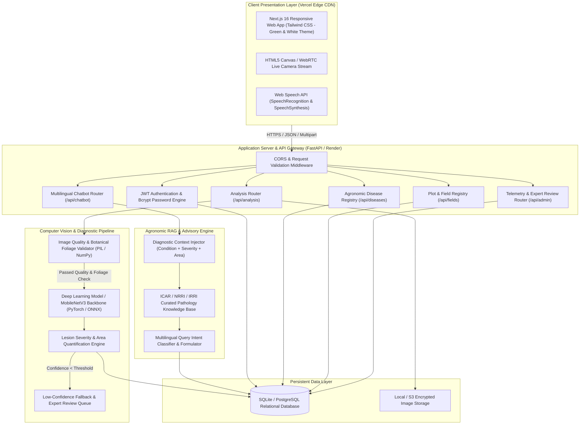
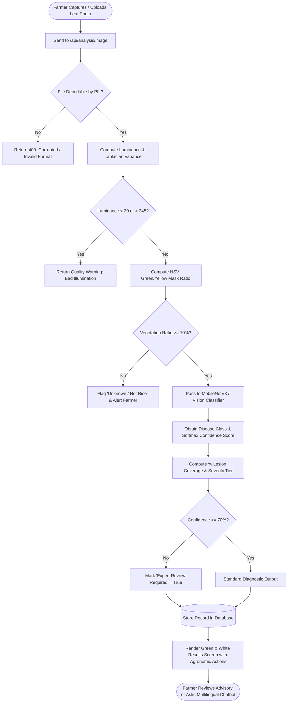
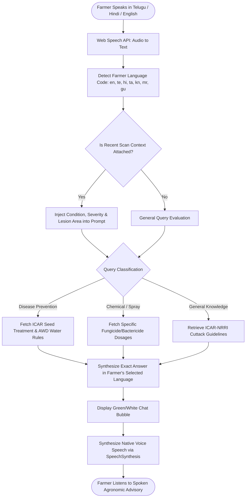

# RICEGUARD AI: SYSTEM DOCUMENTATION AND TECHNICAL SPECIFICATION
**AI-Powered Rice Plant Disease Detection, Severity Quantification, and Multilingual Agronomic Advisory Platform**

---

## 1. Executive Summary & Project Objectives

**RiceGuard AI** is an end-to-end intelligent precision agriculture platform designed to empower smallholder farmers, agricultural extension officers, and agronomists with rapid, field-level rice crop diagnosis. By combining Computer Vision (CV), Deep Neural Networks (MobileNetV3 / Vision Transformers), heuristic botanical validation algorithms, and multilingual generative agronomic intelligence (RAG), RiceGuard AI bridges the diagnostic knowledge gap in paddy cultivation.

### Key Capabilities:
- **Instant Optical Disease Diagnosis**: Identification across 10 major rice leaf conditions (Bacterial Leaf Blight, Brown Spot, Leaf Blast, Sheath Blight, Tungro, Rice Hispa, Leaf Scald, Narrow Brown Spot, Neck Blast, and Healthy Foliage).
- **Botanical Foliage & Image Quality Validation**: Real-time evaluation of brightness, focus blur (Laplacian variance), and vegetative chromaticity (HSV masking) to eliminate non-plant or corrupted inputs.
- **Lesion Severity Quantification**: Accurate measurement of percentage leaf necrosis and automatic classification into actionable risk tiers (Low, Moderate, High).
- **Multilingual Generative Farmer Assistant**: Voice-enabled agronomic guidance in 7 languages (English, Telugu, Hindi, Tamil, Kannada, Marathi, Gujarati) tailored to field conditions, seed treatments, and balanced nutrient management.
- **Production Cloud Architecture**: Fully decoupled microservice design with Next.js (Turbopack) hosted on Vercel, FastAPI backend deployed on Render, and SQLite/PostgreSQL with salted `bcrypt` security.

---

## 2. System Architecture & High-Level Design

The system adheres to a modern, decoupled client-server microservices pattern with strict separation between user interface, edge processing, API routing, computer vision pipelines, and persistent database layers.

### 2.1 Complete Architectural Diagram

---

## 3. Mathematical Formulations & Algorithms

### 3.1 Image Brightness Calculation
Before feeding an image to deep learning inference, the system computes the mean luminance $\mu_{\text{lum}}$ across the Red, Green, and Blue channels to prevent false readings caused by under- or over-exposure:

$$\mu_{\text{lum}} = \frac{1}{3 \times W \times H} \sum_{x=1}^{W} \sum_{y=1}^{H} \left( R(x,y) + G(x,y) + B(x,y) \right)$$

- **Threshold Criteria**:
  - $20.0 \le \mu_{\text{lum}} \le 245.0 \implies \text{Valid Illumination}$
  - $\mu_{\text{lum}} < 20.0 \implies \text{Rejected (Too Dark / Night Photo)}$
  - $\mu_{\text{lum}} > 245.0 \implies \text{Rejected (Extreme Glare / Flash Flare)}$

---

### 3.2 Sharpness & Blur Estimation (Laplacian Variance)
Image sharpness is measured by convolving the grayscale representation $I_{\text{gray}}$ with the discrete 2D Laplacian operator $L$, which acts as a second-order spatial derivative highlighter of high-frequency edges:

$$L(x,y) = \nabla^2 I_{\text{gray}}(x,y) \approx I(x+1,y) + I(x-1,y) + I(x,y+1) + I(x,y-1) - 4I(x,y)$$

The sharpness index $S$ is calculated as the statistical variance of the response matrix:

$$S = \sigma^2(L) = \frac{1}{N} \sum_{i=1}^{N} \left( L_i - \bar{L} \right)^2$$

Where $N = W \times H$ is the total pixel count. If $S < 5.0$ and vegetation ratio is deficient, the image is flagged as motion-blurred or out of focus.

---

### 3.3 Botanical Foliage Ratio (HSV Color Space Masking)
To prevent non-agricultural objects (shoes, walls, faces, vehicles) from receiving disease diagnoses, the image is converted to the Hue-Saturation-Value ($HSV$) cylindrical color space:

$$H = \begin{cases} 
0^\circ & \text{if } \Delta = 0 \\
60^\circ \times \left( \frac{G' - B'}{\Delta} \bmod 6 \right) & \text{if } C_{\max} = R' \\
60^\circ \times \left( \frac{B' - R'}{\Delta} + 2 \right) & \text{if } C_{\max} = G' \\
60^\circ \times \left( \frac{R' - G'}{\Delta} + 4 \right) & \text{if } C_{\max} = B'
\end{cases}$$

Where $R', G', B' \in [0, 1]$, $C_{\max} = \max(R', G', B')$, $C_{\min} = \min(R', G', B')$, and $\Delta = C_{\max} - C_{\min}$.

The **Vegetation Ratio** $V_r$ is determined by the binary segmentation mask $M_{\text{veg}}(x,y)$:

$$M_{\text{veg}}(x,y) = \begin{cases} 
1 & \text{if } 15^\circ \le H(x,y) \le 135^\circ \text{ and } S(x,y) \ge 15\% \\
0 & \text{otherwise}
\end{cases}$$

$$V_r = \frac{\sum_{x,y} M_{\text{veg}}(x,y)}{W \times H}$$

- **Validation Rule**: If $V_r < 0.10$ ($10\%$), the image is rejected with message: `"Not a rice plant or crop foliage"`.

---

### 3.4 Deep Learning Softmax Classification
The neural network model maps the extracted convolutional feature vector $\mathbf{z} = [z_1, z_2, \dots, z_K]^T$ to normalized class probabilities via the Softmax activation function:

$$P(Y = k \mid \mathbf{x}) = \frac{e^{z_k}}{\sum_{j=1}^{K} e^{z_j}} \quad \text{for } k \in \{1, 2, \dots, K\}$$

Where:
- $K = 10$ classes.
- Diagnostic Confidence Score: $C = \max_{k} P(Y = k \mid \mathbf{x})$.
- If $C < 0.70$ ($70\%$), the flag `expert_review_required` is automatically set to `True`.

---

### 3.5 Cross-Entropy Loss & AdamW Optimization
During training of the neural network on agricultural datasets, optimization minimizes the categorical cross-entropy loss with $L_2$ weight regularization:

$$\mathcal{L}_{\text{CE}} = - \sum_{k=1}^{K} y_k \log(\hat{y}_k)$$

$$\mathbf{\theta}_{t+1} = \mathbf{\theta}_t - \frac{\eta}{\sqrt{\hat{v}_t} + \epsilon} \hat{m}_t - \eta \lambda \mathbf{\theta}_t$$

Where:
- $\hat{m}_t$: Bias-corrected first moment estimate (mean gradient).
- $\hat{v}_t$: Bias-corrected second moment estimate (uncentered variance).
- $\lambda$: Weight decay factor ($10^{-4}$).
- $\eta$: Learning rate ($3 \times 10^{-4}$).

---

### 3.6 Lesion Severity Quantification
The affected surface area percentage $A_{\text{lesion}}$ is calculated through color segmentation of necrotic and chlorotic pixels against total foliar area:

$$A_{\text{lesion}} = \left( \frac{\sum_{(x,y) \in \text{Leaf}} M_{\text{lesion}}(x,y)}{\sum_{(x,y) \in \text{Leaf}} M_{\text{leaf}}(x,y)} \right) \times 100\%$$

The severity is mapped onto standard agricultural damage tiers:

$$\text{Severity Level} = \begin{cases} 
\text{Healthy / Low} & \text{if } A_{\text{lesion}} < 15\% \\
\text{Moderate (Spreading)} & \text{if } 15\% \le A_{\text{lesion}} < 28\% \\
\text{High (Critical Emergency)} & \text{if } A_{\text{lesion}} \ge 28\%
\end{cases}$$

---

## 4. End-to-End Execution Flowcharts

### 4.1 Leaf Image Diagnostic Flow

---

### 4.2 Multilingual Farmer Voice & Query Flow

---

## 5. Agronomic Knowledge Base & Supported Pathologies

RiceGuard AI supports 10 distinct rice health conditions curated from ICAR (Indian Council of Agricultural Research), NRRI (National Rice Research Institute), and IRRI (International Rice Research Institute):

| Condition Name | Pathogen / Cause | Characteristic Symptoms | Critical Risk Factors | Verified Recommended Management |
| :--- | :--- | :--- | :--- | :--- |
| **Bacterial Leaf Blight** | *Xanthomonas oryzae pv. oryzae* | Water-soaked wavy stripes from leaf tips downward; milky bacterial ooze in early morning. | Deep standing water, high nitrogen without potassium, stormy winds. | Drain excess water; avoid nitrogen top-dressing; apply Copper Oxychloride (3g) + Streptocycline (0.1g)/L. |
| **Brown Spot** | *Bipolaris oryzae* | Oval brown spots with grey centers and yellow halos uniformly scattered across leaves. | Nutrient-depleted soils, potassium/zinc deficiency, moisture stress. | Balanced N-P-K fertilization; seed treatment with Carbendazim (2g/kg); Mancozeb spray (2.5g/L). |
| **Leaf Blast** | *Magnaporthe oryzae* (Foliar) | Diamond/spindle-shaped lesions with pointed ends, gray centers, and brown borders. | Relative humidity > 90%, night temps 19–23°C, excessive nitrogen. | Split nitrogen doses; apply Tricyclazole 75% WP (0.6g/L) or Isoprothiolane (1.5ml/L). |
| **Sheath Blight** | *Rhizoctonia solani* | Greenish-gray oval lesions with dark borders on leaf sheaths near water line. | Warm temps (28–32°C), high humidity, dense plant canopy. | Optimize spacing (20x15cm); skim floating sclerotia; spray Validamycin (2ml/L) or Hexaconazole (2ml/L). |
| **Tungro** | Rice Tungro Spherical & Bacilliform Virus | Severe plant stunting, delayed flowering, bright orange-yellow discoloration from leaf tips. | Green Leafhopper (*Nephotettix virescens*) vectors, staggered village planting. | Eradicate volunteer host grasses; light traps for leafhoppers; plant resistant varieties. |
| **Rice Hispa** | *Dicladispa armigera* (Insect) | Parallel white streaks on upper leaf surfaces; blistered larval leaf mines. | High rainfall followed by sunny days, grassy weeds on bunds. | Clip seedling tips before transplanting; sweep net beetles; spray Chlorpyrifos 20% EC (2ml/L). |
| **Leaf Scald** | *Microdochium oryzae* | Zonate alternating light tan and dark reddish-brown bands from leaf margins; scalded look. | Heavy rainfall spells, close plant spacing, unbalanced urea use. | Clear post-harvest stubble; apply potassium in split doses; avoid clipping seedlings. |
| **Narrow Brown Spot** | *Cercospora janseana* | Short, narrow, linear reddish-brown lesions parallel to veins; late-season emergence. | Potassium deficiency, warm humid grain-filling weather. | Ensure adequate potash nutrition; avoid late sowings; spray Propiconazole (1ml/L). |
| **Neck Blast** | *Magnaporthe oryzae* (Panicle) | Dark necrotic lesion at panicle neck node; snapped necks, chaffy whitehead grains. | Foliar blast during tillering with continuous rain at heading stage. | Strictly eliminate late nitrogen top-dressing; preventive Tricyclazole spray at 5% heading. |
| **Healthy Foliage** | *Oryza sativa* (Normal) | Uniform vibrant green foliage, erect tillers, absence of lesions or spotting. | Unbalanced fertilization or drought stress could weaken immunity. | Continue recommended irrigation cycles and soil-test-based balanced nutrient management. |

---

## 6. Security, Authentication & Deployment Specifications

### 6.1 Authentication & Security Architecture
- **Cryptographic Password Hashing**: Every credential is automatically salted with a cryptographically secure 128-bit salt using `bcrypt.gensalt()` and hashed using `bcrypt.hashpw(password, salt)`.
- **Stateless Session Tokens**: JSON Web Tokens (JWT) signed with `HS256` and verified through FastAPI dependency injection (`OAuth2PasswordBearer`).
- **Role-Based Access Control (RBAC)**:
  - `FARMER`: Scan access, field management, personal diagnosis history, AI chat.
  - `ADMIN`: Model telemetry, global stats, disease database modification, expert diagnosis reviews.

### 6.2 Pre-Configured Verified Credentials
- **Farmer Demo**: Mobile `9123456780` | Password `Farmer@12345`
- **Admin Demo**: Mobile `9876543210` | Password `Admin@12345`

### 6.3 Hosting & CI/CD Infrastructure
- **Frontend**: Next.js 16 (Turbopack, React 19) hosted on **Vercel** with automatic Git push CI/CD.
- **Backend API**: Python FastAPI (Uvicorn ASGI) deployed on **Render Cloud**.
- **Source Repository**: GitHub [`SIVA2102004/RiceLeafDetection`](https://github.com/SIVA2102004/RiceLeafDetection.git).
